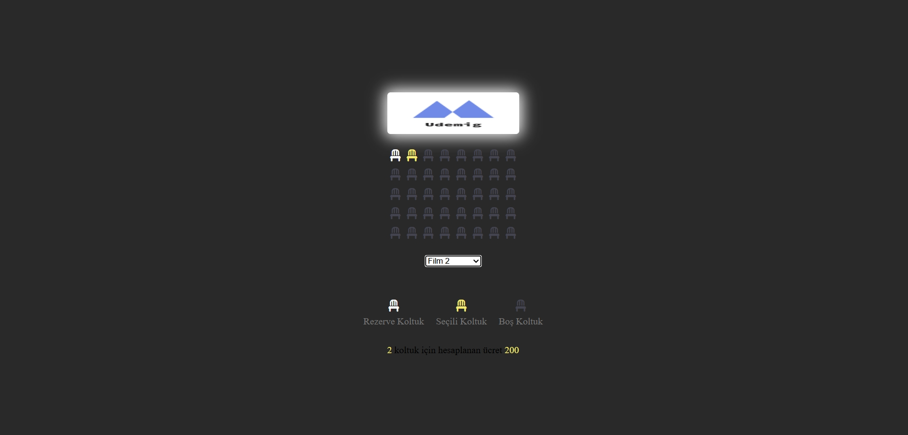

## 🎥 Sinema Rezervasyon Sistemi
📖 Proje Açıklaması
Sinema Rezervasyon Sistemi, kullanıcıların sinema koltuklarını seçerek rezervasyon yapmasını sağlayan bir web uygulamasıdır. Kullanıcılar boş koltukları seçebilir, toplam ücretlerini görebilir ve rezervasyonlarını tamamlayabilir.

## 🚀 Özellikler
🪑 Koltuk Seçimi: Kullanıcılar boş koltukları seçebilir, rezerve edilmiş koltuklar farklı bir renkle gösterilir.
💰 Toplam Ücret Hesaplama: Seçilen koltuk sayısına göre toplam ücret otomatik hesaplanır.
🎫 Dinamik Kullanıcı Arayüzü: Koltuklar ve seçim durumu JavaScript ile dinamik olarak güncellenir.
🌐 Tamamen Responsive: Farklı cihazlarda sorunsuz çalışır.

## 🛠️ Kullanılan Teknolojiler
HTML: Sayfa yapısı.
CSS: Tasarım ve stil düzenlemeleri.
JavaScript: Koltuk seçim işlemleri ve toplam ücret hesaplama.

### Proje Ekran Görüntüsü

